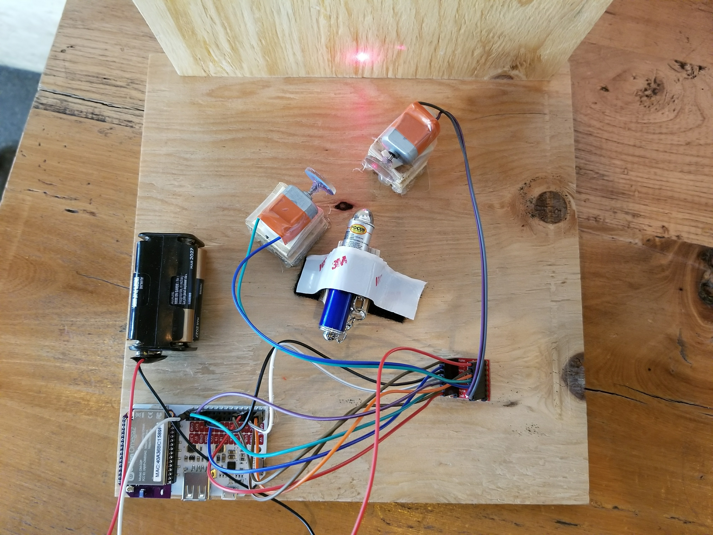
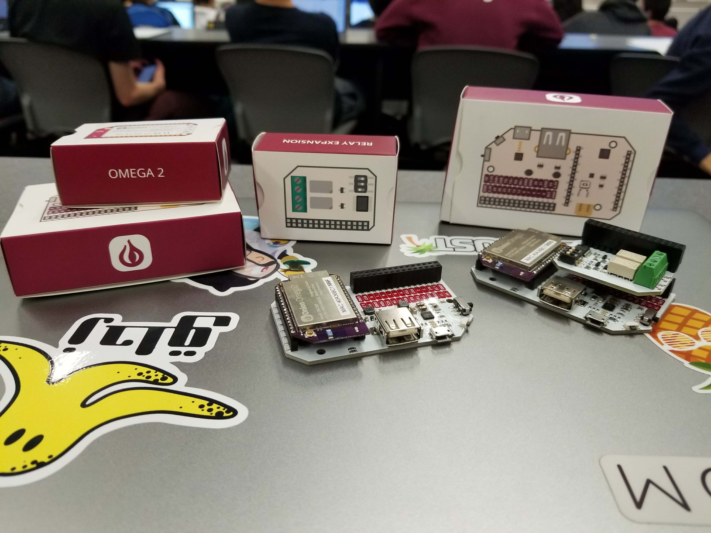

# **Laz0rb0i**

Laz0rb0i is an embedded system that performs an elegant laser show based on a multitude of inputs.

In order to control laz0rb0i, there is a command-line tool **(ground-control)** that allows the user to control two motors with digital input. In order to use this tool, you must compile it using your favourite cpp compiler and run the executable.

Currently, the implemented functionality supports input in the form of strings or sinusoidal functions.
The aim is to develop a Fast-Fourier Transform algorithm in order to be able to convert real-time audio streams into laser displays.

The materials used in this project include:

- (Onion) Omega Power Dock 2
- (Onion) Omega2
- (SparkFun) Motor Driver - Dual TB6612FNG
- Two 6V DC motors
- Two mirrors
- Power source

For the complete description, along with instructions for building laz0rb0i, please refer to the [**laz0rb0i report**](https://github.com/CrypticEskimo/laz0rb0i/blob/master/laz0rb0i_report.pdf).

## Omega2

The Omega2 is an IoT device that runs its own linux OS. In order to run C/C++ code on the Omega2, it must be compiled for the **mips** architecture.

The documentation for the Omega2 can be found [here](https://docs.onion.io/omega2-docs/).
